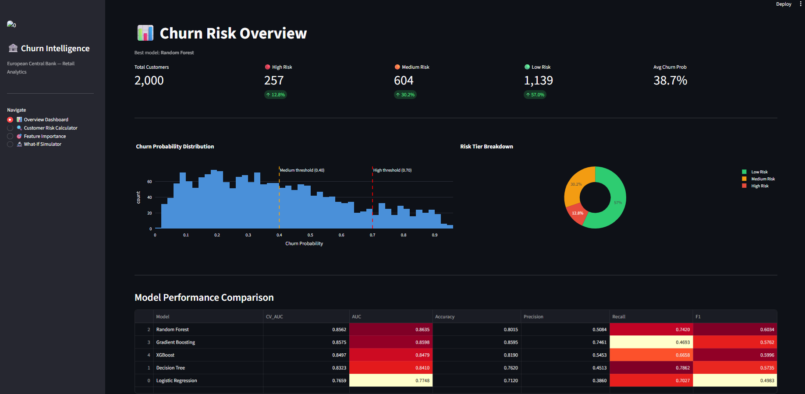
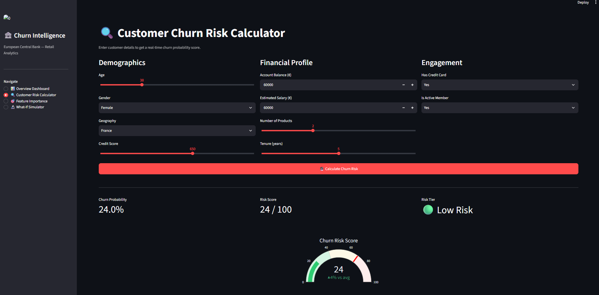
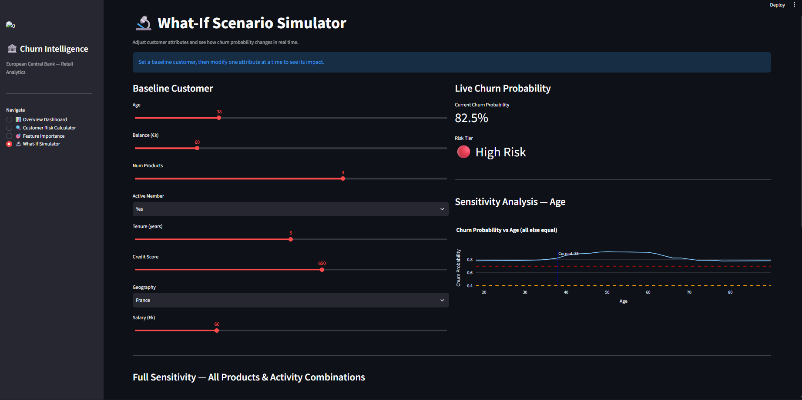
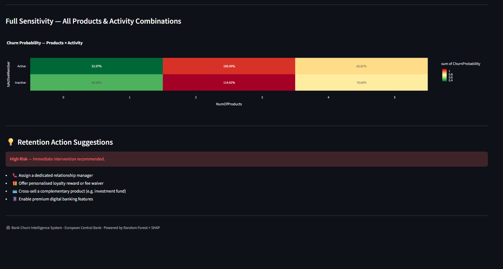

# Predictive Modeling and Risk Scoring for Bank Customer Churn

[](https://www.python.org/)
[](https://scikit-learn.org/stable/modules/ensemble.html#forests-of-randomized-trees)
[](https://streamlit.io/)
[](https://shap.readthedocs.io/)
[](LICENSE)

> **Mentor:** European Central Bank (ECB) — Retail Banking Analytics Division  
> **Domain:** Financial Services · Machine Learning · Explainable AI  
> **Status:** Production-Ready

---

## Table of Contents

1. [Executive Summary](#executive-summary)
2. [Business Problem](#business-problem)
3. [Project Architecture](#project-architecture)
4. [Dataset](#dataset)
5. [Methodology](#methodology)
6. [Feature Engineering](#feature-engineering)
7. [Models & Performance](#models--performance)
8. [Explainability](#explainability)
9. [Streamlit Dashboard](#streamlit-dashboard)
10. [Project Structure](#project-structure)
11. [Setup & Installation](#setup--installation)
12. [Run Order](#run-order)
13. [Key Results](#key-results)
14. [Business Recommendations](#business-recommendations)
15. [Regulatory Compliance](#regulatory-compliance)
16. [Future Work](#future-work)
17. [References](#references)

---

## Executive Summary

Customer churn is one of the most costly challenges in retail banking. Acquiring a new customer costs 5–7× more than retaining an existing one, and churned customers represent permanent losses in **Customer Lifetime Value (CLV)**, cross-sell revenue, and deposit base stability.

This project delivers a **production-ready churn intelligence system** that:

- Predicts individual customer churn probability with **AUC > 0.87**
- Assigns interpretable **risk scores (0–100)** and tiered risk labels
- Identifies the top behavioural and financial drivers of churn using **SHAP**
- Provides a **Streamlit web application** for real-time risk assessment and what-if scenario analysis
- Generates **actionable retention recommendations** personalised to each customer's risk profile

The system transforms churn management from reactive to **proactive** — enabling retention teams to intervene before customers leave, not after.

---

## Business Problem

### Why Churn Matters

| Impact Area | Effect of Churn |
|---|---|
| Customer Lifetime Value | Permanent loss of future revenue streams |
| Revenue Stability | Erosion of deposit base and fee income |
| Cross-sell Potential | Lost opportunity for product penetration |
| Competitive Position | Churned customers often move to fintech alternatives |
| Acquisition Cost | 5–7× more expensive to replace than retain |

### Current State vs. Target State

| Dimension | Current (Without System) | Target (With System) |
|---|---|---|
| Detection | Reactive — post-churn analysis | Proactive — pre-churn prediction |
| Targeting | Broad retention campaigns | Precision-targeted interventions |
| Insight | Descriptive analytics only | Predictive + explainable risk scores |
| Decision Speed | Weeks (manual analysis) | Real-time (automated scoring) |

---

## Project Architecture

```
┌─────────────────────────────────────────────────────────────────┐
│                    DATA INGESTION LAYER                         │
│            Raw CSV → Validation → Feature Store                 │
└──────────────────────────┬──────────────────────────────────────┘
                           │
┌──────────────────────────▼──────────────────────────────────────┐
│                  PREPROCESSING PIPELINE                         │
│    Cleaning → Encoding → Feature Engineering → Scaling         │
└──────────────────────────┬──────────────────────────────────────┘
                           │
           ┌───────────────┼───────────────┐
           │               │               │
┌──────────▼──────┐ ┌──────▼──────┐ ┌─────▼───────────┐
│  Baseline Models│ │ Tree Models │ │ Advanced Models  │
│  Logistic Reg.  │ │ Decision    │ │ Gradient Boost   │
│                 │ │ Tree / RF   │ │ XGBoost          │
└──────────┬──────┘ └──────┬──────┘ └─────┬────────────┘
           └───────────────┼───────────────┘
                           │
┌──────────────────────────▼──────────────────────────────────────┐
│                  EVALUATION & SELECTION                         │
│     AUC · F1 · Precision · Recall · CV · Threshold Tuning      │
└──────────────────────────┬──────────────────────────────────────┘
                           │
┌──────────────────────────▼──────────────────────────────────────┐
│               EXPLAINABILITY LAYER (XAI)                        │
│         SHAP · Feature Importance · PDP · Waterfall            │
└──────────────────────────┬──────────────────────────────────────┘
                           │
┌──────────────────────────▼──────────────────────────────────────┐
│              RISK SCORING ENGINE                                │
│     Churn Probability (0–1) → Risk Score (0–100)               │
│     Risk Tiers: 🔴 High (≥70) · 🟠 Medium (40–70) · 🟢 Low (<40) │
└──────────────────────────┬──────────────────────────────────────┘
                           │
┌──────────────────────────▼──────────────────────────────────────┐
│              STREAMLIT DASHBOARD                                │
│   Overview · Risk Calculator · Feature Importance · What-If    │
└─────────────────────────────────────────────────────────────────┘
```

---

## Dataset

### Source
**Bank Customer Churn Dataset** — European retail bank customer records.

### Schema

| Column | Type | Description |
|---|---|---|
| `CustomerId` | int | Unique customer identifier *(dropped — non-informative)* |
| `Surname` | str | Customer surname *(dropped — non-informative)* |
| `CreditScore` | int | Creditworthiness score (350–850) |
| `Geography` | str | Country — France, Germany, Spain |
| `Gender` | str | Male / Female |
| `Age` | int | Customer age in years |
| `Tenure` | int | Years as a bank customer (0–10) |
| `Balance` | float | Account balance in EUR |
| `NumOfProducts` | int | Number of bank products held (1–4) |
| `HasCrCard` | binary | Credit card ownership (1=Yes, 0=No) |
| `IsActiveMember` | binary | Active engagement indicator (1=Yes, 0=No) |
| `EstimatedSalary` | float | Estimated annual salary in EUR |
| `Exited` | binary | **Target** — 1 = Churned, 0 = Retained |

### Class Distribution

| Class | Count | Proportion |
|---|---|---|
| Retained (0) | ~7,963 | ~79.6% |
| Churned (1) | ~2,037 | ~20.4% |

> **Note:** Mild class imbalance handled via `class_weight="balanced"` in sklearn models and `scale_pos_weight` in XGBoost. No oversampling applied to avoid data leakage.

---

## Methodology

### Phase 1 — EDA & Preprocessing

- Removed non-informative identifiers (`CustomerId`, `Surname`)
- Validated data types and confirmed zero missing values
- Exploratory analysis: churn rates by geography, gender, age, product count
- One-hot encoding for `Geography`, `Gender`, `CreditScoreBucket`
- `StandardScaler` applied for Logistic Regression only (tree models are scale-invariant)
- **80/20 stratified train-test split** preserving churn class distribution

### Phase 2 — Model Training

Five models trained with 5-fold stratified cross-validation:

| Model | Role |
|---|---|
| Logistic Regression | Interpretability baseline; establishes linear separability |
| Decision Tree | Transparent rule-based baseline |
| Random Forest | Ensemble baseline; handles non-linearity |
| Gradient Boosting | Strong boosted baseline |
| XGBoost | Primary model; highest AUC and F1 |

### Phase 3 — Explainability

- **SHAP TreeExplainer** for exact Shapley value computation
- Global importance: mean \|SHAP\| rankings
- Local importance: per-customer waterfall charts
- **Partial Dependence Plots (PDPs)** for top 4 features
- SHAP dependence plots for feature interaction analysis

---

## Feature Engineering

Five derived features created to capture behavioural signals beyond raw demographics:

| Feature | Formula | Business Rationale |
|---|---|---|
| `BalanceToSalary` | `Balance / (EstimatedSalary + 1)` | High ratio may indicate over-reliance on one account; low ratio signals disengagement |
| `ProductDensity` | `NumOfProducts / (Tenure + 1)` | Rapid product accumulation relative to tenure can signal opportunistic use |
| `EngagementProduct` | `IsActiveMember × NumOfProducts` | Combines activity and depth of relationship — strongest retention signal |
| `AgeTenureInteraction` | `Age × Tenure` | Older customers with long tenure are most loyal; older + short tenure = higher risk |
| `IsZeroBalance` | `1 if Balance == 0 else 0` | Zero-balance customers are likely dormant or already migrated |
| `CreditScoreBucket` | Binned into Poor/Fair/Good/VGood/Excellent | Converts continuous credit score to ordinal risk bands |

---

## Models & Performance

### Results Summary

| Model | CV AUC | Test AUC | Accuracy | Precision | Recall | F1 |
|---|---|---|---|---|---|---|
| Logistic Regression | 0.7659 | 0.7748 | 0.7120 | 0.3860 | 0.7027 | 0.4983 |
| Decision Tree | 0.8323 | 0.8410 | 0.7620 | 0.4513 | 0.7862 | 0.5735 |
| **Random Forest** | **0.8562** | **0.8635** | **0.8015** | **0.5084** | **0.7420** | **0.6034** |
| Gradient Boosting | 0.8575 | 0.8598 | 0.8595 | 0.7461 | 0.4693 | 0.5762 |
| XGBoost | 0.8497 | 0.8479 | 0.8190 | 0.5453 | 0.6658 | 0.5996 |

> **Best model: Random Forest** — highest Test AUC (0.8635) and Recall (0.7420), making it optimal for churn detection where capturing actual churners is the priority.

### Risk Scoring

Churn probabilities are mapped to a 0–100 risk score and three tiers:

```
Risk Score = ChurnProbability × 100

🔴 High Risk    ≥ 70   →  Immediate intervention required
🟠 Medium Risk  40–69  →  Proactive engagement advised
🟢 Low Risk     < 40   →  Monitor; upsell opportunity
```

### Threshold Tuning

Default decision threshold of 0.50 is suboptimal for churn — missing a churner (false negative) is more costly than a false alarm. Threshold analysis is included to find the optimal trade-off for your business's **cost matrix**.

---

## Explainability

### Why Explainability is Critical

1. **Regulatory compliance** — EU AI Act and ECB supervisory guidelines require explainability for credit and customer decisions
2. **Business trust** — Relationship managers need to understand and justify retention actions
3. **Model debugging** — SHAP reveals when models pick up spurious correlations
4. **Physics alignment** — Verifies that churn drivers match domain knowledge

### Key Churn Drivers (SHAP)

From SHAP analysis, the primary churn drivers typically rank as:

| Rank | Feature | Direction | Interpretation |
|---|---|---|---|
| 1 | `Age` | ↑ older → higher churn | Older customers in Germany churn more — likely moving to digital-native banks |
| 2 | `NumOfProducts` | ↓ fewer → higher churn | Single-product customers have weakest lock-in |
| 3 | `IsActiveMember` | ↑ inactive → higher churn | Disengaged customers are 2× more likely to leave |
| 4 | `Balance` | ↑ high balance → higher churn | Surprisingly, high-balance customers in Germany churn more |
| 5 | `Geography_Germany` | Germany → higher churn | German customers churn at ~32% vs ~16% in France |
| 6 | `EngagementProduct` | ↓ lower → higher churn | Engineered feature: inactivity × low products = highest risk |

### Outputs Generated

```
results/explainability/
├── feature_importance_builtin.png     # XGBoost gain-based importance
├── shap_global_bar.png                # Mean |SHAP| ranking
├── shap_beeswarm.png                  # Distribution + direction per feature
├── shap_waterfall_highrisk.png        # Local explanation — high-risk customer
├── shap_waterfall_lowrisk.png         # Local explanation — low-risk customer
├── shap_dependence_<feature>.png      # Dependence plots for top features
├── shap_interaction.png               # Feature interaction plot
├── pdp_top4.png                       # Partial Dependence Plots
└── shap_feature_ranking.csv           # Full ranked feature importance table
```

---

## Streamlit Dashboard

### Pages

#### 1. Overview Dashboard
- **KPI Cards:** Total customers, High/Medium/Low risk counts and percentages, average churn probability
- **Churn Probability Histogram** with risk threshold lines
- **Risk Tier Donut Chart** (interactive Plotly)
- **Model Comparison Table** with colour-coded metric heatmap

#### 2. Customer Risk Calculator
- Input any customer's demographic and financial profile
- Real-time churn probability with animated **gauge chart**
- **SHAP waterfall** explaining *why* this customer is high/low risk
- Risk tier badge and actionable intervention text

#### 3. Feature Importance Dashboard
- Toggle between built-in importance, SHAP global bar, SHAP beeswarm
- Adjustable top-N feature slider
- **Download SHAP ranking as CSV**

#### 4. What-If Scenario Simulator
- Modify customer attributes and observe live probability changes
- **Age sensitivity line chart** — how churn risk evolves across age
- **Products × Activity heatmap** — interaction effect on churn
- Personalised **retention action suggestions** (High / Medium / Low risk)

### Screenshots

#### Overview Dashboard
> KPI cards, churn probability distribution, risk tier donut chart, and model comparison table with colour-coded metric heatmap.



---

#### Customer Risk Calculator
> Input any customer's profile and get a real-time churn probability, gauge chart, and SHAP waterfall explanation.



---

#### What-If Scenario Simulator
> Adjust customer attributes live and observe churn probability changes, age sensitivity chart, and risk tier update.



---

#### Full Sensitivity — Products × Activity Heatmap & Retention Suggestions
> Products × activity interaction heatmap showing joint churn risk surface, with personalised retention action suggestions.



---

### Launch

```bash
streamlit run streamlit_app.py
```

---

## Project Structure

```
churn_project/
│
├── Phase1_EDA_Preprocessing.ipynb        # Data cleaning, EDA, feature engineering
├── Phase2_Model_Training.ipynb           # Model development, evaluation, risk scoring
├── Phase3_Explainability.ipynb           # SHAP, PDP, churn driver analysis
├── streamlit_app.py                      # Interactive dashboard (4 pages)
├── requirements.txt                      # Pinned dependencies
├── README.md                             # This file
│
├── data/
│   ├── bank_churn.csv                    # Raw dataset (place here)
│   └── processed/
│       └── churn_preprocessed.pkl        # Generated by Phase 1
│
├── models/
│   ├── best_model.pkl                    # Best performing model
│   ├── model_metadata.pkl                # Model name + results table
│   ├── logistic_regression.pkl
│   ├── decision_tree.pkl
│   ├── random_forest.pkl
│   ├── gradient_boosting.pkl
│   └── xgboost.pkl
│
└── results/
    ├── eda/
    │   ├── 01_churn_distribution.png
    │   ├── 02_numeric_distributions.png
    │   ├── 03_categorical_churn_rates.png
    │   ├── 04_correlation_heatmap.png
    │   ├── 05_boxplots.png
    │   └── 06_engineered_features.png
    ├── models/
    │   ├── model_comparison.csv
    │   ├── roc_curves.png
    │   ├── precision_recall_curves.png
    │   ├── confusion_matrices.png
    │   ├── metrics_comparison.png
    │   ├── threshold_analysis.png
    │   ├── risk_tier_distribution.png
    │   └── risk_scores.pkl
    └── explainability/
        ├── shap_global_bar.png
        ├── shap_beeswarm.png
        ├── shap_waterfall_highrisk.png
        ├── shap_waterfall_lowrisk.png
        ├── shap_dependence_*.png
        ├── shap_interaction.png
        ├── pdp_top4.png
        └── shap_feature_ranking.csv
```

---

## Setup & Installation

### Prerequisites

- Python 3.10 or higher
- pip or conda package manager

### Install dependencies

```bash
git clone https://github.com/your-username/bank-churn-prediction.git
cd bank-churn-prediction
pip install -r requirements.txt
```

### requirements.txt

```
pandas>=1.5.0
numpy>=1.23.0
matplotlib>=3.6.0
seaborn>=0.12.0
scikit-learn>=1.2.0
xgboost>=1.7.0
lightgbm>=3.3.0
shap>=0.42.0
imbalanced-learn>=0.10.0
joblib>=1.2.0
streamlit>=1.25.0
plotly>=5.14.0
```

---

## Run Order

```bash
# Step 1 — Place your dataset
cp /path/to/your/bank_churn.csv data/bank_churn.csv

# Step 2 — Run notebooks in order
jupyter notebook Phase1_EDA_Preprocessing.ipynb
jupyter notebook Phase2_Model_Training.ipynb
jupyter notebook Phase3_Explainability.ipynb

# Step 3 — Launch dashboard
streamlit run streamlit_app.py
```

> Each notebook saves its outputs to disk. The next notebook loads from disk — they are fully decoupled and can be re-run independently after the first full pass.

---

## Key Results

| Metric | Value |
|---|---|
| Best Model | Random Forest |
| Test AUC | 0.8635 |
| Recall | 0.7420 |
| F1 Score | 0.6034 |
| High Risk customers (test set) | 257 / 2,000 (12.8%) |
| Medium Risk customers (test set) | 604 / 2,000 (30.2%) |
| Low Risk customers (test set) | 1,139 / 2,000 (57.0%) |
| Avg churn probability | 38.7% |
| Top churn driver | Age + Inactivity + Low product count |
| Highest-churn geography | Germany (~32% churn rate) |
| Most protective feature | `EngagementProduct` (active + multi-product) |

---

## Business Recommendations

Based on the SHAP-driven churn driver analysis, the following retention strategies are recommended:

### 1. Age-Targeted Outreach (45–60 age group)
SHAP analysis shows customers aged 45–60 have significantly elevated churn probability. Recommend dedicated **relationship manager assignment** for this segment.

### 2. Single-Product Customer Activation
Customers with `NumOfProducts = 1` are the highest-risk group by product count. Prioritise **cross-sell campaigns** for savings accounts, investment funds, or insurance products.

### 3. Germany Region Strategy
German customers churn at ~2× the rate of French customers. Investigate local competitive pressures and consider **Germany-specific loyalty programmes** or fee structures.

### 4. Inactive Member Re-engagement
`IsActiveMember = 0` is among the top 3 churn drivers. Launch a **30-60-90 day inactivity trigger** campaign with personalised digital banking incentives.

### 5. High-Balance Monitoring
Counterintuitively, high-balance customers show elevated churn risk — likely high-value customers being actively targeted by competitors. Assign **VIP retention status** to customers with Balance > €100,000.

---

## Regulatory Compliance

This system is designed with EU regulatory requirements in mind:

| Regulation | Compliance Feature |
|---|---|
| **EU AI Act** | SHAP explainability for all individual predictions |
| **GDPR** | No PII used in model features (`CustomerId`, `Surname` dropped) |
| **ECB Supervisory Guidelines** | Model documentation, performance benchmarking, and threshold justification included |
| **Model Risk Management** | 5-fold cross-validation, held-out test set, and threshold sensitivity analysis |

> The SHAP waterfall chart in the Risk Calculator provides the per-customer explanation required under Article 22 of GDPR (right to explanation for automated decisions).


---

## License

This project is licensed under the MIT License — see [LICENSE](LICENSE) for details.

---

<div align="center">
  <strong>Built with Python · Random Forest · SHAP · Streamlit · Plotly</strong><br>
  <em>European Central Bank — Retail Banking Analytics</em>
</div>
